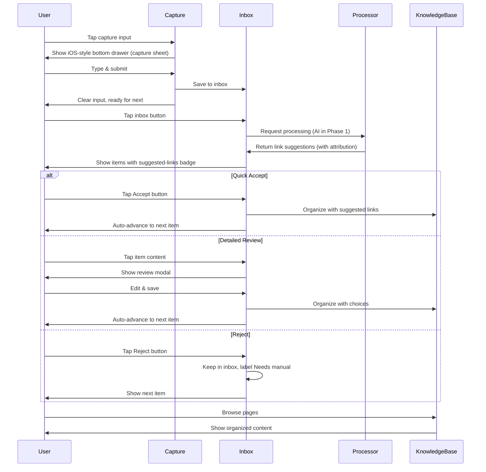

# Core Flows: Letuscook Mobile App

## Overview

This document defines the core user flows for Letuscook's mobile app. The app uses a Notion-inspired single-page layout with floating UI elements for quick access to key functions: capture, inbox, search, and knowledge base navigation.

### Phase 1 Assumptions (Auth + Offline)

- Users may **capture items while offline and before logging in** ("offline guest capture").
- **Sign-in is required** to sync to cloud, run inbox processing (AI in Phase 1), organize into the Knowledge Base graph, and use Search.
- Items captured while offline/guest appear as **"Offline"** until sign-in + sync.

## Layout Structure

The app uses a persistent layout with floating action elements:

- **Top Left**: User profile button
- **Top Right**: Inbox button + More menu button
- **Main Window**: Knowledge Base content area
- **Bottom Left**: Search button (floating)
- **Bottom Middle**: Capture input (floating)

```wireframe
<!DOCTYPE html>
<html>
<head>
<style>
* { margin: 0; padding: 0; box-sizing: border-box; }
body { font-family: -apple-system, BlinkMacSystemFont, sans-serif; background: #f5f5f5; }
.screen { width: 375px; height: 667px; margin: 20px auto; background: white; position: relative; border: 1px solid #ddd; }
.header { position: absolute; top: 0; left: 0; right: 0; height: 60px; background: white; border-bottom: 1px solid #e0e0e0; display: flex; align-items: center; justify-content: space-between; padding: 0 16px; z-index: 10; }
.profile-btn { width: 36px; height: 36px; border-radius: 18px; background: #e0e0e0; border: none; }
.header-right { display: flex; gap: 12px; }
.icon-btn { width: 36px; height: 36px; border-radius: 18px; background: #f0f0f0; border: 1px solid #ddd; display: flex; align-items: center; justify-content: center; font-size: 18px; }
.main-content { position: absolute; top: 60px; left: 0; right: 0; bottom: 80px; overflow-y: auto; padding: 16px; }
.empty-state { text-align: center; padding: 60px 20px; color: #666; }
.empty-state h2 { font-size: 20px; margin-bottom: 8px; color: #333; }
.empty-state p { font-size: 14px; }
.bottom-bar { position: absolute; bottom: 0; left: 0; right: 0; height: 80px; background: white; border-top: 1px solid #e0e0e0; display: flex; align-items: center; justify-content: center; padding: 0 16px; gap: 12px; }
.search-btn { width: 48px; height: 48px; border-radius: 24px; background: #f0f0f0; border: 1px solid #ddd; display: flex; align-items: center; justify-content: center; font-size: 20px; }
.capture-input { flex: 1; height: 48px; border-radius: 24px; background: white; border: 1px solid #ddd; padding: 0 20px; font-size: 15px; color: #999; }
</style>
</head>
<body>
<div class="screen">
  <div class="header">
    <button class="profile-btn" data-element-id="profile-button"></button>
    <div class="header-right">
      <button class="icon-btn" data-element-id="inbox-button">📥</button>
      <button class="icon-btn" data-element-id="more-button">⋯</button>
    </div>
  </div>

  <div class="main-content">
    <div class="empty-state">
      <h2>Welcome to Letuscook</h2>
      <p>Start capturing your thoughts, tasks, and links below</p>
    </div>
  </div>

  <div class="bottom-bar">
    <button class="search-btn" data-element-id="search-button">🔍</button>
    <input class="capture-input" data-element-id="capture-input" placeholder="Capture anything..." readonly />
  </div>
</div>
</body>
</html>
```

## Flow 1: Quick Capture

**Description**: User captures thoughts, tasks, or links instantly with minimal friction.

**Trigger**: User taps the floating capture input at bottom middle of screen.

**Steps**:

1. User taps capture input
2. App opens an iOS-style bottom drawer (bottom sheet) capture interface
3. Drawer shows:

- Grab handle + lightweight header ("Capture")
- Recent captures above (stream-of-consciousness log, backed by all non-archived captures, ordered by most recent)
- **captureType selector** (Text / Link / Task segmented control; default: Text) in the input area, above the text input
- Text input docked below the selector (directly above the keyboard when open)
- Send button next to input

4. User selects a capture type (Text, Link, or Task), then types their content

- Optional: typing `@` opens link autocomplete (when signed in + synced) so the user can link to an existing page/item

5. User submits by tapping the send button

- Pressing Enter/Return inserts a newline (multi-line capture)

6. Item is saved to the local inbox immediately with timestamp and the selected `captureType`
7. If offline or not signed in, item is marked **"Offline"** until sign-in + sync

- **Guest limit**: if the user has already captured 100 items without signing in, show a **"Sign in to continue capturing"** prompt instead of saving

8. Input clears, ready for next capture
9. User can continue capturing, or dismiss the drawer by swiping down on the sheet
10. Dismissing returns to the main Knowledge Base view

**UI Feedback**:

- Smooth bottom-drawer slide-up animation (iOS sheet style)
- Background behind drawer remains visible (optionally dimmed)
- Input auto-focuses on open
- Grab handle communicates the drawer is draggable / dismissible
- Recent captures show with timestamps (all non-archived captures, any state)
- **captureType selector** visible above the text input; selected type is highlighted
- Send button highlights when text is entered
- Enter/Return adds a newline (does not submit)
- Brief success indicator on submit

```wireframe
<!DOCTYPE html>
<html>
<head>
<style>
* { margin: 0; padding: 0; box-sizing: border-box; }
body { font-family: -apple-system, BlinkMacSystemFont, sans-serif; background: white; }
.screen { width: 375px; height: 667px; margin: 20px auto; background: white; position: relative; border: 1px solid #ddd; overflow: hidden; }

/* Background: Knowledge Base surface (placeholder) */
.kb-surface { position: absolute; top: 0; left: 0; right: 0; bottom: 0; background: #ffffff; }
.kb-header { height: 60px; border-bottom: 1px solid #e0e0e0; display: flex; align-items: center; justify-content: space-between; padding: 0 16px; }
.kb-title { font-size: 16px; font-weight: 600; }

/* Dim overlay behind the drawer */
.overlay { position: absolute; top: 0; left: 0; right: 0; bottom: 0; background: rgba(0,0,0,0.25); }

/* Keyboard placeholder */
.keyboard-spacer { position: absolute; left: 0; right: 0; bottom: 0; height: 280px; background: #d1d5db; border-top: 1px solid #999; display: flex; align-items: center; justify-content: center; color: #666; font-size: 14px; }

/* iOS-style bottom drawer */
.drawer { position: absolute; left: 0; right: 0; bottom: 280px; height: 387px; background: white; border-top-left-radius: 18px; border-top-right-radius: 18px; box-shadow: 0 -10px 30px rgba(0,0,0,0.15); display: flex; flex-direction: column; }
.drawer-grabber { width: 36px; height: 5px; border-radius: 3px; background: #d1d5db; margin: 10px auto 6px; }
.drawer-header { height: 44px; display: flex; align-items: center; justify-content: center; padding: 0 16px; border-bottom: 1px solid #f0f0f0; }
.drawer-title { font-size: 16px; font-weight: 600; }
.type-selector { display: flex; gap: 4px; background: #f0f0f0; border-radius: 8px; padding: 3px; margin-bottom: 8px; align-self: stretch; justify-content: center; }
.type-btn { flex: 1; padding: 5px 0; border-radius: 6px; font-size: 13px; font-weight: 500; border: none; background: transparent; color: #555; cursor: pointer; }
.type-btn-active { background: white; color: #007AFF; box-shadow: 0 1px 3px rgba(0,0,0,0.15); }

.chat-messages { flex: 1; overflow-y: auto; padding: 14px 16px; display: flex; flex-direction: column; gap: 12px; }
.message { background: #f0f0f0; padding: 12px 16px; border-radius: 16px; max-width: 90%; }
.message-time { font-size: 11px; color: #999; margin-top: 4px; }

.input-area { padding: 12px 16px; background: white; border-top: 1px solid #e0e0e0; display: flex; gap: 8px; align-items: flex-end; }
.chat-input { flex: 1; min-height: 40px; max-height: 120px; border: 1px solid #ddd; border-radius: 20px; padding: 10px 16px; font-size: 15px; resize: none; font-family: inherit; }
.send-btn { width: 40px; height: 40px; border-radius: 20px; background: #007AFF; border: none; color: white; font-size: 18px; display: flex; align-items: center; justify-content: center; }
</style>
</head>
<body>
<div class="screen">
  <div class="kb-surface">
    <div class="kb-header">
      <div class="kb-title">Knowledge Base</div>
      <div style="opacity:0.4;">[floating UI]</div>
    </div>
  </div>

  <div class="overlay"></div>

  <div class="drawer">
    <div class="drawer-grabber"></div>
<div class="drawer-header">
      <div class="drawer-title">Capture</div>
    </div>

    <div class="chat-messages">
      <div class="message">
        Buy groceries tomorrow
        <div class="message-time">2 hours ago</div>
      </div>
      <div class="message">
        https://example.com/interesting-article
        <div class="message-time">1 hour ago</div>
      </div>
      <div class="message">
        Remember to call mom about weekend plans
        <div class="message-time">30 min ago</div>
      </div>
    </div>

    <div class="input-area" style="flex-direction: column; gap: 8px;">
      <div class="type-selector">
        <button class="type-btn type-btn-active" data-element-id="type-text">Text</button>
        <button class="type-btn" data-element-id="type-link">Link</button>
        <button class="type-btn" data-element-id="type-task">Task</button>
      </div>
      <div style="display: flex; gap: 8px; align-items: flex-end;">
        <textarea class="chat-input" data-element-id="capture-textarea" placeholder="What's on your mind?"></textarea>
        <button class="send-btn" data-element-id="send-button">↑</button>
      </div>
    </div>
  </div>

  <div class="keyboard-spacer">[Keyboard Area]</div>
</div>
</body>
</html>
```

## Flow 2: View Inbox

**Description**: User reviews unprocessed **captures** (inbox entries) waiting to be organized.

**Trigger**: User taps Inbox button (top right).

**Steps**:

1. User taps Inbox button
2. Right-side drawer slides in, taking over entire view
3. Drawer shows:

- Header with a **back button on the left**, "Inbox" title, and optional "Sign in" CTA (if not authenticated)
  - Items grouped by date sections (Today, Yesterday, This Week, Older)
  - Each item shows preview text + a **state pill**:
    - **Offline** (captured offline/guest; not yet synced)
    - **Processing** (an inbox processor is working on it — AI in Phase 1, human collaborator in future)
    - **Ready** (a suggested organization is available, with attribution)
    - **Failed** (the processor failed or couldn’t complete it)
    - **Needs manual** (suggestion rejected; must be organized manually)
- If state is **Ready**, the capture shows: a **suggested-links** badge (with attribution) + Accept/Reject buttons
  - If state is not Ready, Accept/Reject buttons are hidden (tap to open detail)

1. User can:

- Scroll through captures
- Tap capture content to open detailed review/edit at any time (manual overrides the suggestion)
- Tap "Accept" (Ready only) to accept the suggestion and organize the capture
- Tap "Reject" (Ready only) to mark the suggestion wrong and label capture **Needs manual**

2. Back button returns to Knowledge Base view

**UI Feedback**:

- Smooth slide-in animation from right
- Section headers are sticky during scroll
- State pills communicate progress/failure/offline clearly
- Accept/Reject buttons are shown only for Ready captures (hidden otherwise)

```wireframe
<!DOCTYPE html>
<html>
<head>
<style>
* { margin: 0; padding: 0; box-sizing: border-box; }
body { font-family: -apple-system, BlinkMacSystemFont, sans-serif; background: white; }
.screen { width: 375px; height: 667px; margin: 20px auto; background: white; position: relative; border: 1px solid #ddd; }
.inbox-header { height: 60px; background: white; border-bottom: 1px solid #e0e0e0; display: flex; align-items: center; padding: 0 16px; gap: 12px; }
.back-btn { font-size: 24px; background: none; border: none; color: #007AFF; width: 32px; }
.inbox-title { font-size: 20px; font-weight: 600; flex: 1; text-align: center; }
.header-actions { display: flex; align-items: center; gap: 10px; justify-content: flex-end; min-width: 72px; }
.signin-btn { font-size: 12px; padding: 6px 10px; border-radius: 12px; border: 1px solid #ddd; background: #fff; }
.inbox-content { height: calc(667px - 60px); overflow-y: auto; }
.date-section { margin-bottom: 24px; }
.section-header { padding: 12px 16px; background: #f8f8f8; font-size: 13px; font-weight: 600; color: #666; text-transform: uppercase; position: sticky; top: 0; }
.capture-item { padding: 16px; border-bottom: 1px solid #f0f0f0; display: flex; flex-direction: column; gap: 10px; }
.item-text { font-size: 15px; color: #333; }
.item-row { display: flex; justify-content: space-between; gap: 10px; align-items: center; }
.item-meta { display: flex; gap: 8px; align-items: center; flex-wrap: wrap; }
.pill { font-size: 11px; padding: 3px 8px; border-radius: 999px; border: 1px solid #ddd; color: #444; background: #fff; }
.pill-ready { border-color: #c8e6c9; background: #e8f5e9; color: #2e7d32; }
.pill-processing { border-color: #bbdefb; background: #e3f2fd; color: #1565c0; }
.pill-failed { border-color: #ffcdd2; background: #ffebee; color: #c62828; }
.pill-offline { border-color: #e0e0e0; background: #f5f5f5; color: #616161; }
.pill-manual { border-color: #ffe0b2; background: #fff3e0; color: #ef6c00; }
.ai-badge { font-size: 12px; padding: 4px 8px; background: #e3f2fd; color: #1976d2; border-radius: 4px; }
.item-time { font-size: 12px; color: #999; }
.item-actions { display: flex; gap: 8px; }
.action-btn { flex: 1; padding: 8px 16px; border-radius: 6px; font-size: 14px; font-weight: 600; border: none; }
.accept-btn { background: #4caf50; color: white; }
.reject-btn { background: #f0f0f0; color: #666; }
</style>
</head>
<body>
<div class="screen">
<div class="inbox-header">
    <button class="back-btn" data-element-id="back-inbox">←</button>
    <div class="inbox-title">Inbox</div>
    <div class="header-actions">
      <button class="signin-btn" data-element-id="signin-cta">Sign in</button>
    </div>
  </div>

  <div class="inbox-content">
    <div class="date-section">
      <div class="section-header">Today</div>

      <div class="inbox-item" data-element-id="inbox-ready">
        <div class="item-text">Research Convex database for backend architecture</div>
        <div class="item-row">
          <div class="item-meta">
            <span class="pill pill-ready">Ready</span>
<span class="ai-badge">Suggested by CookBot</span>
            <span class="item-time">2:30 PM</span>
          </div>
        </div>
        <div class="item-actions">
          <button class="action-btn accept-btn" data-element-id="accept-btn-ready">Accept</button>
          <button class="action-btn reject-btn" data-element-id="reject-btn-ready">Reject</button>
        </div>
      </div>

      <div class="inbox-item" data-element-id="inbox-processing">
        <div class="item-text">Buy milk and eggs on the way home</div>
        <div class="item-row">
          <div class="item-meta">
            <span class="pill pill-processing">Processing</span>
            <span class="item-time">1:15 PM</span>
          </div>
        </div>
      </div>

      <div class="inbox-item" data-element-id="inbox-offline">
        <div class="item-text">https://example.com/ai-cost-optimization</div>
        <div class="item-row">
          <div class="item-meta">
            <span class="pill pill-offline">Offline</span>
            <span class="item-time">10:45 AM</span>
          </div>
        </div>
      </div>

      <div class="inbox-item" data-element-id="inbox-failed">
        <div class="item-text">Summarize notes from yesterday’s meeting</div>
        <div class="item-row">
          <div class="item-meta">
            <span class="pill pill-failed">Failed</span>
            <span class="item-time">9:05 AM</span>
          </div>
        </div>
      </div>

      <div class="inbox-item" data-element-id="inbox-manual">
        <div class="item-text">Plan weekend trip itinerary</div>
        <div class="item-row">
          <div class="item-meta">
            <span class="pill pill-manual">Needs manual</span>
            <span class="item-time">8:40 AM</span>
          </div>
        </div>
      </div>

    </div>
  </div>
</div>
</body>
</html>
```

## Flow 3: Quick Accept (Button)

**Description**: User quickly accepts the **suggested links** without detailed review.

**Trigger**: User taps "Accept" button on an inbox capture (only available when capture state is **Ready**).

**Steps**:

1. User taps "Accept" button on a Ready inbox capture
2. Item animates out of inbox
3. Item is organized using the suggestion
4. Item is treated as **verified** (user accepted the suggestion)
5. A **Knowledge Base page/node** is created/updated (so it appears in the KB list)
6. Next item auto-advances into view (continuous flow)
7. If no more items in current section, moves to next section
8. If inbox is empty, shows empty state

**UI Feedback**:

- Button highlights on tap
- Smooth slide-out animation
- Brief success indicator (checkmark)
- Auto-scroll to next item

**Future Enhancement**: Swipe-right gesture for quick accept (Phase 2)

## Flow 4: Reject (Button)

**Description**: User indicates the suggested links are not useful and the item needs manual processing.

**Trigger**: User taps "Reject" button on an inbox capture (only available when capture state is **Ready**).

**Steps**:

1. User taps "Reject" button on a Ready inbox capture
2. Capture stays in inbox and is labeled **"Needs manual"**
3. Capture remains available for manual organization (tap to open detail)
4. Capture may move lower in its date section to keep the user moving forward
5. Next Ready/unreviewed item comes into focus

**UI Feedback**:

- Button highlights on tap
- Item dims slightly to show it's been reviewed
- Smooth reordering animation

**Future Enhancement**: Swipe-left gesture for reject (Phase 2)

## Flow 5: Detailed Review

**Description**: User opens an **inbox capture** for detailed review, editing, and manual organization (resulting in a Knowledge Base page/node once organized).

**Trigger**: User taps an inbox item (any state).

**Steps**:

1. User taps inbox item
2. Full-screen review modal slides up
3. Modal shows:

- Header with a **back button on the left** and title
- **Title input** (prefilled when the processor suggests a title)
- Item content (editable text area)
- Item state: Offline / Processing / Ready / Failed / Needs manual
- Links section (always), including any **suggested links** from the suggestor (AI agent in Phase 1)
- Actions: Save (organize), Discard changes, and an overflow menu with **Archive**

4. User can:

- Edit the content at any time
  - Typing `@` opens an autocomplete to link to an existing page/item (creates explicit graph edges)
- Edit the title (node title)
- Add/remove links to pages (via `@` linking)
- Review **suggested links** (if present) and keep/remove them before saving
- View related items/links (explicit + suggested)

5. If item state is **Failed**, user can choose: retry processing (AI in Phase 1) OR organize manually
6. User taps Save
7. Capture is organized and treated as verified; the resulting page/node appears in the Knowledge Base list
8. Modal closes
9. Auto-advances to next relevant inbox item

**UI Feedback**:

- Smooth slide-up animation
- Keyboard appears when editing content
- Suggested links (when present) show who suggested them (e.g., AI agent in Phase 1)
- Title may be prefilled from the suggestor’s proposed node title (not a separate “Suggested Organization” panel)
- Save button highlights when changes made
- Loading indicator during save
- Success confirmation before auto-advance

```wireframe
<!DOCTYPE html>
<html>
<head>
<style>
* { margin: 0; padding: 0; box-sizing: border-box; }
body { font-family: -apple-system, BlinkMacSystemFont, sans-serif; background: white; }
.screen { width: 375px; height: 667px; margin: 20px auto; background: white; position: relative; border: 1px solid #ddd; display: flex; flex-direction: column; }
.review-header { height: 60px; background: white; border-bottom: 1px solid #e0e0e0; display: flex; align-items: center; padding: 0 16px; gap: 12px; }
.back-btn { font-size: 24px; background: none; border: none; color: #007AFF; width: 32px; }
.header-title { font-size: 17px; font-weight: 600; flex: 1; text-align: center; }
.review-content { flex: 1; overflow-y: auto; padding: 16px; }
.section { margin-bottom: 24px; }
.section-label { font-size: 13px; font-weight: 600; color: #666; margin-bottom: 8px; text-transform: uppercase; }
.content-input { width: 100%; min-height: 100px; padding: 12px; border: 1px solid #ddd; border-radius: 8px; font-size: 15px; font-family: inherit; resize: vertical; }
.ai-suggestion { background: #f8f9fa; border: 1px solid #e0e0e0; border-radius: 8px; padding: 16px; }
.suggestion-header { display: flex; justify-content: space-between; align-items: center; margin-bottom: 12px; }
.suggestion-title { font-size: 14px; font-weight: 600; }
.confidence { font-size: 12px; color: #666; }
.title-input { width: 100%; padding: 10px; border: 1px solid #ddd; border-radius: 6px; font-size: 15px; margin-bottom: 12px; }
.links-container { display: flex; flex-wrap: wrap; gap: 8px; }
.link-chip { padding: 6px 12px; background: #f3e5f5; color: #6a1b9a; border-radius: 16px; font-size: 13px; display: flex; align-items: center; gap: 6px; }
.link-remove { background: none; border: none; color: #6a1b9a; font-size: 16px; cursor: pointer; }
.action-buttons { padding: 16px; background: white; border-top: 1px solid #e0e0e0; display: flex; gap: 12px; }
.btn { flex: 1; padding: 14px; border-radius: 8px; font-size: 16px; font-weight: 600; border: none; }
.btn-primary { background: #007AFF; color: white; }
.btn-secondary { background: #f0f0f0; color: #333; }
</style>
</head>
<body>
<div class="screen">
<div class="review-header">
    <button class="back-btn" data-element-id="back-review">←</button>
    <div class="header-title">Review Item</div>
    <div style="width: 24px;"></div>
  </div>

  <div class="review-content">
      <div class="section">
      <div class="section-label">Title</div>
      <input class="title-input" data-element-id="title-input" placeholder="Title" value="Technical Research" />

      <div class="section-label" style="margin-top: 12px;">Links</div>
      <div class="links-container">
        <div class="link-chip">
          @Backend Architecture <span style="font-size: 11px; color: #999;">Suggested</span>
          <button class="link-remove" data-element-id="remove-link-1">×</button>
        </div>
        <div class="link-chip">
          @Convex
          <button class="link-remove" data-element-id="remove-link-2">×</button>
        </div>
      </div>
      <div style="margin-top: 8px; font-size: 12px; color: #666;">
        Tip: type <b>@</b> in the editor to link to a page
      </div>
    </div>

    <div class="section">
      <div class="section-label">Content</div>
      <textarea class="content-input" data-element-id="content-input">Research Convex database for backend architecture</textarea>
    </div>
  </div>

  <div class="action-buttons">
    <button class="btn btn-secondary" data-element-id="discard-button">Discard</button>
    <button class="btn btn-primary" data-element-id="save-button">Save</button>
  </div>
</div>
</body>
</html>
```

## Flow 6: Browse Knowledge Base

**Description**: User browses their **recent pages** in the knowledge base (graph-first, no categories/tags).

**Trigger**: Default view when app opens (if user has any pages).

**Steps**:

1. Main window shows Knowledge Base
2. Content displayed as a vertical list of **recent pages**

- Sorted by most recently updated
- If there are no pages yet, show the onboarding empty state prompting capture/review

3. Each page shows:

- Page title
- Icon/emoji (if set)
- Preview snippet
- Lightweight metadata (linked-pages indicator, not tags/categories)

4. User scrolls through pages
5. User taps a page to view full content
6. Full page view shows:

- Page title and metadata (last updated, link count)
  - Full content
  - Related items/links
  - Edit button

1. User can navigate back to list or to related pages

**UI Feedback**:

- Smooth scrolling
- Page titles are scannablew
- Tap highlights page briefly
- Smooth transition to full page view
- Back button returns to list

```wireframe
<!DOCTYPE html>
<html>
<head>
<style>
* { margin: 0; padding: 0; box-sizing: border-box; }
body { font-family: -apple-system, BlinkMacSystemFont, sans-serif; background: white; }
.screen { width: 375px; height: 667px; margin: 20px auto; background: white; position: relative; border: 1px solid #ddd; }
.header { position: absolute; top: 0; left: 0; right: 0; height: 60px; background: white; border-bottom: 1px solid #e0e0e0; display: flex; align-items: center; justify-content: space-between; padding: 0 16px; z-index: 10; }
.profile-btn { width: 36px; height: 36px; border-radius: 18px; background: #e0e0e0; border: none; }
.header-right { display: flex; gap: 12px; }
.icon-btn { width: 36px; height: 36px; border-radius: 18px; background: #f0f0f0; border: 1px solid #ddd; display: flex; align-items: center; justify-content: center; font-size: 18px; }
.kb-content { position: absolute; top: 60px; left: 0; right: 0; bottom: 80px; overflow-y: auto; }
.page-list { padding: 8px; }
.page-item { padding: 16px; border-radius: 8px; margin-bottom: 8px; background: #f8f9fa; border: 1px solid #e0e0e0; }
.page-header { display: flex; align-items: center; gap: 8px; margin-bottom: 8px; }
.page-icon { font-size: 20px; }
.page-title { font-size: 16px; font-weight: 600; flex: 1; }
.page-preview { font-size: 14px; color: #666; margin-bottom: 8px; }
.page-meta { display: flex; flex-wrap: wrap; gap: 6px; }
.meta-pill { padding: 4px 10px; background: #f0f0f0; color: #666; border-radius: 999px; font-size: 12px; }
.bottom-bar { position: absolute; bottom: 0; left: 0; right: 0; height: 80px; background: white; border-top: 1px solid #e0e0e0; display: flex; align-items: center; justify-content: center; padding: 0 16px; gap: 12px; }
.search-btn { width: 48px; height: 48px; border-radius: 24px; background: #f0f0f0; border: 1px solid #ddd; display: flex; align-items: center; justify-content: center; font-size: 20px; }
.capture-input { flex: 1; height: 48px; border-radius: 24px; background: white; border: 1px solid #ddd; padding: 0 20px; font-size: 15px; color: #999; }
</style>
</head>
<body>
<div class="screen">
  <div class="header">
    <button class="profile-btn" data-element-id="profile-button"></button>
    <div class="header-right">
      <button class="icon-btn" data-element-id="inbox-button">📥</button>
      <button class="icon-btn" data-element-id="more-button">⋯</button>
    </div>
  </div>

  <div class="kb-content">
    <div class="page-list">
      <div class="page-item" data-element-id="page-1">
        <div class="page-header">
          <span class="page-icon">📚</span>
          <span class="page-title">Technical Research</span>
        </div>
        <div class="page-preview">Notes and findings about backend architecture, databases, and infrastructure decisions...</div>
        <div class="page-meta">
          <span class="meta-pill">🔗 3 links</span>
        </div>
      </div>

      <div class="page-item" data-element-id="page-2">
        <div class="page-header">
          <span class="page-icon">✓</span>
          <span class="page-title">Personal Tasks</span>
        </div>
        <div class="page-preview">Ongoing tasks and reminders for personal life management...</div>
        <div class="page-meta">
          <span class="meta-pill">🔗 1 link</span>
        </div>
      </div>

      <div class="page-item" data-element-id="page-3">
        <div class="page-header">
          <span class="page-icon">🔗</span>
          <span class="page-title">Reading List</span>
        </div>
        <div class="page-preview">Articles and resources to read about AI, productivity, and software development...</div>
        <div class="page-meta">
          <span class="meta-pill">🔗 5 links</span>
        </div>
      </div>
    </div>
  </div>

  <div class="bottom-bar">
    <button class="search-btn" data-element-id="search-button">🔍</button>
    <input class="capture-input" data-element-id="capture-input" placeholder="Capture anything..." readonly />
  </div>
</div>
</body>
</html>
```

## Flow 7: Global Search

**Description**: User searches across all synced content (inbox + knowledge base) to find information quickly.

**Trigger**: User taps Search button (bottom left).

**Steps**:

1. User taps Search button
2. App opens an **iOS-style bottom drawer (bottom sheet) Search panel** from the bottom
3. If user is not signed in:

- Show "Sign in to sync and search" CTA inside the drawer
- Keep search input visible but disabled

4. If signed in:

- Search input is docked at the bottom of the drawer, directly above keyboard (one-handed friendly)
- User types search query
- Results appear instantly as user types

5. Results show:

- Matching items from inbox
- Matching pages from knowledge base
- Highlighted matching text
- Source indicator (Inbox vs. Knowledge Base)

6. User taps a result to open it
7. Opening inbox item goes to detailed review
8. Opening knowledge base page shows full page view
9. User dismisses Search by swiping down on the drawer; app returns to the previous view

**UI Feedback**:

- Smooth bottom-drawer slide-up animation (iOS sheet style)
- Background behind the drawer remains visible (optionally dimmed)
- Search input auto-focuses
- Results update in real-time
- Loading indicator for search
- No results state if query doesn't match
- Keyboard dismisses when result tapped

```wireframe
<!DOCTYPE html>
<html>
<head>
<style>
* { margin: 0; padding: 0; box-sizing: border-box; }
body { font-family: -apple-system, BlinkMacSystemFont, sans-serif; background: white; }
.screen { width: 375px; height: 667px; margin: 20px auto; background: white; position: relative; border: 1px solid #ddd; overflow: hidden; }

/* Background surface (whatever user was viewing) */
.bg-surface { position: absolute; top: 0; left: 0; right: 0; bottom: 0; background: #ffffff; }
.bg-header { height: 60px; border-bottom: 1px solid #e0e0e0; display: flex; align-items: center; justify-content: space-between; padding: 0 16px; }
.bg-title { font-size: 16px; font-weight: 600; }

/* Dim overlay behind the search drawer */
.overlay { position: absolute; top: 0; left: 0; right: 0; bottom: 0; background: rgba(0,0,0,0.25); }

/* Keyboard placeholder area (not a real UI element) */
.keyboard-spacer { position: absolute; left: 0; right: 0; bottom: 0; height: 280px; background: #d1d5db; border-top: 1px solid #999; display: flex; align-items: center; justify-content: center; color: #666; font-size: 14px; }

/* iOS-style bottom drawer for Search */
.drawer { position: absolute; left: 0; right: 0; bottom: 280px; height: 387px; background: white; border-top-left-radius: 18px; border-top-right-radius: 18px; box-shadow: 0 -10px 30px rgba(0,0,0,0.15); display: flex; flex-direction: column; }
.drawer-grabber { width: 36px; height: 5px; border-radius: 3px; background: #d1d5db; margin: 10px auto 6px; }
.drawer-header { height: 44px; display: flex; align-items: center; justify-content: center; padding: 0 16px; border-bottom: 1px solid #f0f0f0; }
.drawer-title { font-size: 16px; font-weight: 600; }

/* Results live inside the drawer */
.search-results { flex: 1; overflow-y: auto; }
.result-section { margin-bottom: 16px; }
.section-header { padding: 12px 16px; background: #f8f8f8; font-size: 13px; font-weight: 600; color: #666; text-transform: uppercase; }
.result-item { padding: 16px; border-bottom: 1px solid #f0f0f0; }
.result-title { font-size: 15px; color: #333; margin-bottom: 4px; }
.result-preview { font-size: 14px; color: #666; }
.result-meta { display: flex; gap: 8px; align-items: center; margin-top: 8px; }
.source-badge { font-size: 11px; padding: 3px 8px; background: #f0f0f0; color: #666; border-radius: 4px; }
.highlight { background: #fff59d; }

/* Input docked at bottom of drawer (and sits directly above keyboard when open) */
.search-input-bar { padding: 12px 16px; background: white; border-top: 1px solid #e0e0e0; display: flex; align-items: center; gap: 12px; }
.search-input { flex: 1; height: 40px; border: 1px solid #ddd; border-radius: 20px; padding: 0 16px; font-size: 15px; }
</style>
</head>
<body>
<div class="screen">
  <div class="bg-surface">
    <div class="bg-header">
      <div class="bg-title">Knowledge Base</div>
      <div style="opacity:0.4;">[floating UI]</div>
    </div>
  </div>

  <div class="overlay"></div>

  <div class="drawer">
    <div class="drawer-grabber"></div>
    <div class="drawer-header">
      <div class="drawer-title">Search</div>
    </div>

    <div class="search-results">
      <div class="result-section">
        <div class="section-header">Inbox (1)</div>
        <div class="result-item" data-element-id="result-1">
          <div class="result-title">Research <span class="highlight">Convex</span> database for backend</div>
          <div class="result-preview">Looking into <span class="highlight">Convex</span> as a potential backend solution...</div>
          <div class="result-meta">
            <span class="source-badge">📥 Inbox</span>
            <span style="font-size: 12px; color: #999;">Today 2:30 PM</span>
          </div>
        </div>
      </div>

      <div class="result-section">
        <div class="section-header">Knowledge Base (2)</div>
        <div class="result-item" data-element-id="result-2">
          <div class="result-title">Technical Research</div>
          <div class="result-preview">...comparing <span class="highlight">Convex</span> vs Supabase for real-time features...</div>
          <div class="result-meta">
            <span class="source-badge">📚 Page</span>
            <span style="font-size: 12px; color: #999;">3 items</span>
          </div>
        </div>
        <div class="result-item" data-element-id="result-3">
          <div class="result-title">Backend Architecture</div>
          <div class="result-preview"><span class="highlight">Convex</span> provides serverless functions and real-time database...</div>
          <div class="result-meta">
            <span class="source-badge">📚 Page</span>
            <span style="font-size: 12px; color: #999;">5 items</span>
          </div>
        </div>
      </div>
    </div>

    <div class="search-input-bar">
      <input class="search-input" data-element-id="search-input" placeholder="Search everything..." value="convex" />
    </div>
  </div>

  <div class="keyboard-spacer">[Keyboard Area]</div>
</div>
</body>
</html>
```

## Flow 8: Archive + Archived View

**Description**: Users can remove items from active views without permanent deletion.

**Trigger / Entry Points**:

- From Detailed Review overflow menu: Archive item
- From More menu: Open Archived view

**Steps**:

1. User chooses Archive for an item (capture or node/page)
2. Item is removed from Inbox / Knowledge Base lists
3. Item is removed from active views and **is not included in Global Search**
4. Item remains recoverable in the Archived view
5. In Archived view, user can:

- Unarchive (restore)
- View item detail

```wireframe
<!DOCTYPE html>
<html>
<head>
<style>
* { margin: 0; padding: 0; box-sizing: border-box; }
body { font-family: -apple-system, BlinkMacSystemFont, sans-serif; background: white; }
.screen { width: 375px; height: 667px; margin: 20px auto; background: white; border: 1px solid #ddd; }
.header { height: 60px; border-bottom: 1px solid #e0e0e0; display: flex; align-items: center; padding: 0 16px; justify-content: space-between; }
.title { font-size: 20px; font-weight: 600; }
.back-btn-arch { font-size: 24px; background: none; border: none; color: #007AFF; width: 32px; }
.list { height: calc(667px - 60px); overflow-y: auto; }
.item { padding: 16px; border-bottom: 1px solid #f0f0f0; }
.row { display: flex; justify-content: space-between; align-items: center; gap: 8px; }
.btn { font-size: 12px; padding: 6px 10px; border-radius: 12px; border: 1px solid #ddd; background: #fff; }
.meta { font-size: 12px; color: #999; margin-top: 6px; }
</style>
</head>
<body>
<div class="screen">
  <div class="header">
    <button class="back-btn-arch" data-element-id="back-archived">←</button>
    <div class="title">Archived</div>
    <div style="width: 32px;"></div>
  </div>
  <div class="list">
    <div class="item" data-element-id="archived-1">
      <div class="row">
        <div>Old note about travel credits</div>
        <button class="btn" data-element-id="unarchive-1">Unarchive</button>
      </div>
      <div class="meta">Archived yesterday</div>
    </div>
  </div>
</div>
</body>
</html>
```

## User Journey Map



## Key Interaction Patterns

### Floating UI Elements

All primary actions are accessible via floating buttons that persist across views:

- **Capture**: Always available at bottom middle
- **Search**: Always available at bottom left
- **Inbox**: Always available at top right
- **Profile/More**: Always available at top corners

### Continuous Flow

After organizing an item, the app auto-advances to the next unprocessed item, creating a smooth review workflow without manual navigation.

### Button Actions (Phase 1)

- **Accept Button** (Ready only): Accept the suggested links and organize the capture into a Knowledge Base page/node
- **Reject Button** (Ready only): Mark suggested links as not useful; label capture **Needs manual**
- **Tap Item Content**: Open detailed review (works for any item state)

Note: When an item is **Offline / Processing / Failed / Needs manual**, Accept/Reject buttons are hidden and the user processes via the detailed review.

**Future Enhancement (Phase 2)**: Swipe gestures for accept/reject

### Suggestion Transparency

Suggested links (when present) show:

- Attribution (e.g., AI in Phase 1; human collaborator in future)
- Suggested links (graph connections)
  - May reference existing pages and/or propose new concept titles
- User can keep/remove suggested links before saving
- Once the user saves/accepts, the resulting edges are treated as user-verified

### Search Everywhere

Global search covers both unprocessed (inbox) and organized (knowledge base) content, with clear source indicators in results.

- Presented as an **iOS-style bottom drawer** (like Capture)
- Input is docked directly above the keyboard for fast one-handed access
