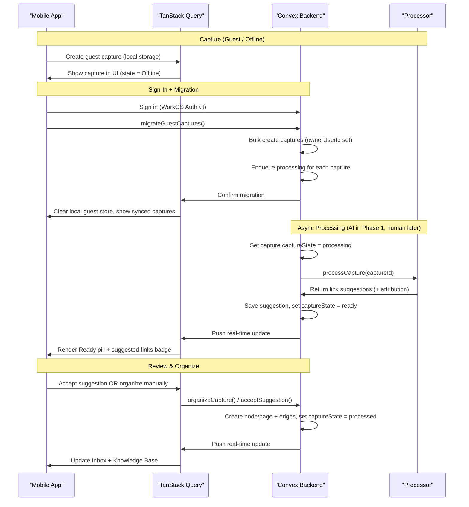

# Technical Plan: Letuscook Architecture

## Architectural Approach

### Core Architecture Pattern

**Convex-First Local-First Architecture**

Letuscook uses Convex as the primary backend, providing real-time database, serverless functions, and authentication in a unified platform. The architecture is local-first, meaning the mobile app works offline and syncs automatically when online.

**Key Architectural Decisions:**

1. **Convex as Primary Backend**
  - **Rationale**: Convex provides real-time reactivity, serverless functions (mutations/queries/actions), built-in auth, and automatic offline sync—eliminating the need for separate database, API server, WebSocket infrastructure, and sync logic
  - **Trade-offs**: Vendor lock-in, but the productivity gains and built-in features (real-time, offline, auth) outweigh this for an MVP
  - **Fallback**: Cloudflare Workers available for tasks Convex can't handle (e.g., heavy compute, specific edge requirements)
2. **Local-First with Offline Guest Capture**
  - **Rationale**: Users can capture thoughts offline and without logging in ("offline guest capture"); sign-in is required only to sync, organize, and search
  - **Trade-offs**: Need to handle anonymous local storage and migration to authenticated user on sign-in, but critical for zero-friction capture
  - **Conflict Resolution**: Convex's built-in automatic resolution (last-write-wins with vector clocks)
  - **Guest-to-Auth Migration**: On sign-in, migrate locally stored **guest captures** to the user's Convex account
  - **Guest capture limit**: capped at **100 items** in AsyncStorage; on the 101st attempt, show a "Sign in to continue capturing" prompt (hard gate, no silent eviction)
3. **Graph-Based Knowledge Structure**
  - **Rationale**: Flexible, mirrors how knowledge actually connects (like Obsidian/web), supports both explicit user links and processor-suggested connections
  - **Trade-offs**: More complex queries than hierarchical structure, but provides superior knowledge discovery and navigation
  - **Implementation**: Separate `captures`, `nodes`, and `edges` tables for clean representation (raw intake vs. post-processed knowledge graph)
  - **Edge Ownership Model**: Edges do **not** carry `ownerUserId`. Ownership and visibility are derived from the endpoint nodes — if you have access to both `fromNodeId` and `toNodeId`, you see the edge. This avoids per-edge permission rows and makes the Phase 2 sharing model trivially correct.
4. **TanStack Query + Convex Integration**
  - **Rationale**: TanStack Query provides familiar React patterns, caching, and optimistic updates; Convex adapter provides real-time subscriptions
  - **Trade-offs**: Additional abstraction layer vs. using Convex React hooks directly, but TanStack Query's ecosystem and patterns are well-established
  - **Benefits**: Unified data fetching patterns, better DevTools, easier testing
5. **Async Inbox Processing (Processor-based) with Routing**
  - **Rationale**: Inbox processing happens asynchronously (Convex queue mutation orchestrator + internal action for external provider calls) to keep capture fast. In Phase 1 the processor is AI; in future it can be a human collaborator producing the same kind of suggestion.
  - **Trade-offs**: Complexity in routing, retries, and attribution, but necessary for reliability and cost control
  - **Failure Handling**: Exponential backoff retry (3 attempts), then fallback to user manual organization
6. **Suggestion Provenance (Phase 1 trust model)**
  - **Rationale**: Suggestions are produced by a **suggestor user** (AI agent account, seeded via a Convex deploy script). The suggested node and edges are created directly under the **capture owner's `ownerUserId**` — not the suggestor's. This avoids all cross-tenant reads and keeps the security model identical to normal node/edge queries.
  - **Trade-offs**: The suggestor writes into the owner's graph on their behalf; `suggestorUserId` is only stored for attribution display.
  - **Implementation**:
    - AI agent user is seeded by running a **Convex deploy script** that creates the agent's `users` row (`userType="agent"`, `agentProvider`, `agentModel`).
    - `suggestorUserId` is set by whatever function processes the captures queue — that function resolves the agent user's ID at runtime (e.g., by querying `users` by `userType="agent"`).
    - Provider/model live on the suggestor's `users` row (`userType="agent"`).
    - Audit log is deferred to Phase 2.
7. **WorkOS AuthKit Integration (Optional for Capture)**
  - **Rationale**: Enterprise-ready auth from day one, supports OAuth providers, SSO, and user management
  - **Trade-offs**: More complex than simple device-based auth, but positions product for future team/enterprise features
  - **Integration**: Convex Auth + WorkOS AuthKit adapter
  - **Auth Gating**: Capture works without auth; sync, organize, search, and processor-based processing (AI in Phase 1) require sign-in

### Technology Stack

**Frontend (Mobile)**

- React Native (Expo) - cross-platform mobile development
- TanStack Query - data fetching and caching
- Convex React adapter - real-time subscriptions
- Expo Router - file-based routing and navigation (tabs used internally, hidden in UI)
- rn-reusables - shared UI components

**Backend (Convex)**

- Convex Database - real-time document database
- Convex Functions - mutations, queries, actions
- Convex Auth - authentication with WorkOS
- Convex Search - full-text search indexes
- Convex File Storage - for attachments (future)

**Inbox Processor Integration (Phase 1: AI)**

- Vercel AI SDK ([https://ai-sdk.dev/](https://ai-sdk.dev/)) - unified LLM interface + provider adapters (Phase 1 AI processor implementation)
- OpenAI (via Vercel AI SDK) - primary capture processing (suggest node title + links; extract structured fields)
- Anthropic Claude (via Vercel AI SDK) - fallback and complex reasoning
- Google Gemini (via Vercel AI SDK) - cost-effective fallback
- Implemented in `apps/assistant-convex` (Convex internal action for provider calls)
- Model routing + fallbacks implemented via Convex internal action + mutation orchestration
- Future: human collaborator processor (e.g., secretary / personal assistant) produces the same suggestion shape

**Infrastructure**

- Cloudflare Workers - edge compute (if needed)
- WorkOS - authentication and user management

### Data Flow Architecture



### Offline-Guest Capture Strategy

**Guest Mode (No Auth)**

- Users can capture **captures** (inbox entries) without signing in
- Guest captures are stored in local device storage (AsyncStorage or similar)
- Guest captures are labeled **"Offline"** in the UI (client-only state prior to migration)
- No server-side processing (no processor), no sync, no search until sign-in

**Sign-In Migration**

- On sign-in, trigger `migrateGuestCaptures` mutation
- Bulk upload local guest captures to Convex with `ownerUserId`
- Enqueue processing for each migrated capture (AI processor in Phase 1)
- Clear local storage after successful migration
- Show migration progress in UI

**Authenticated Offline**

- After sign-in, offline capture still works
- Captures queue for sync when connection returns
- Convex client handles automatic sync

**Optimistic Updates**

- All mutations use optimistic updates via TanStack Query
- UI updates immediately, syncs in background
- Rollback on conflict or error

**Conflict Resolution**

- Convex handles conflicts automatically using vector clocks
- Last-write-wins for most fields
- Phase 1 does not include an audit log (deferred to Phase 2); debugging relies on timestamps + suggestion metadata

**Sync Indicators**

- Show sync status in UI (synced, syncing, offline)
- Show "Sign in to sync" CTA for guest users
- Queue mutations when offline, replay on reconnect

## Data Model

### Core Entities

#### Users Table

A simple user table supporting both humans and AI agents (processors).

```typescript
// Convex schema definition
users: defineTable({
  // Identity
  displayName: v.string(),
  email: v.optional(v.string()),

  // Auth provider linkage (WorkOS / AuthKit)
  workosUserId: v.optional(v.string()),

  // Type
  userType: v.union(v.literal("human"), v.literal("agent")),

  // If userType = agent
  agentProvider: v.optional(v.string()),
  agentModel: v.optional(v.string()),

  // Timestamps
  createdAt: v.number(),
  updatedAt: v.number(),
})
  .index("by_workos_user_id", ["workosUserId"])
  .index("by_user_type", ["userType"])
```

#### Captures Table (Inbox entries / raw submissions)

Captures (aka **Inbox items**) are the *raw*, user-submitted inputs. They have a **captureType** which determines how the input is processed.

```typescript
// Convex schema definition
captures: defineTable({
  // Raw user submission
  rawContent: v.string(),
  captureType: v.union(
    v.literal("text"),
    v.literal("link"),
    v.literal("task")
  ), // capture type defines how we process a capture

  // Timestamps
  capturedAt: v.number(), // set by client; preserved through guest migration
  updatedAt: v.number(),
  archivedAt: v.optional(v.number()),

  // Ownership
  ownerUserId: v.id("users"), // authenticated only; guest captures are local until migration

  // Capture workflow state (inbox processing pipeline + processed)
  // NOTE: "Offline" is a client-only state for guest captures stored locally.
  // NOTE: Archival is represented by `archivedAt` (not by `captureState`).
  captureState: v.union(
    // Inbox states
    v.literal("processing"),
    v.literal("ready"),
    v.literal("failed"),
    v.literal("needs_manual"),

    // Terminal state
    v.literal("processed")
  ),

  // The resulting node/page once organized (Phase 1: 0..1)
  nodeId: v.optional(v.id("nodes")),

  // Parsed explicit @mentions at last edit (helps create edges when organizing)
  // NOTE: must be provided on insert; use [] when none.
  explicitMentionNodeIds: v.array(v.id("nodes")),
})
.index("by_owner_capture_state", ["ownerUserId", "captureState"])
  // ArchivedAt is optional but still indexable in Convex; we can query `archivedAt = undefined` via indexes.
  .index("by_owner_archivedAt", ["ownerUserId", "archivedAt"])
  .index("by_owner_archivedAt_capture_state", ["ownerUserId", "archivedAt", "captureState"])
  .index("by_owner_node", ["ownerUserId", "nodeId"])
  .searchIndex("search_raw", {
    searchField: "rawContent",
    filterFields: ["ownerUserId", "captureState", "archivedAt"]
  })
```

**Lifecycle note (simplicity):** captures are treated as an *append-only intake log*.

- Users may edit a capture while it is still in the Inbox (during review).
- Once organized (`captureState=processed`), the primary editable object becomes the node/page; the capture remains as historical provenance.

#### Nodes Table (Knowledge graph pages / post-processed content)

Nodes are the **post-processed** Knowledge Base content (graph pages). Nodes do **not** have `captureType` because they are already processed/structured.

```typescript
// Convex schema definition
nodes: defineTable({
  // Display + content
  title: v.string(),
  content: v.string(), // markdown / rich text source

  // Full-text search field (keep in sync on write)
  // e.g., `${title}\n\n${content}`
  searchText: v.string(),

  // Timestamps + ownership
  createdAt: v.number(),
  updatedAt: v.number(),
  ownerUserId: v.id("users"),

  // Visibility / lifecycle
  // Phase 1: nodes created by the processor for suggestions are created as *drafts* (publishedAt is unset)
  // so they do not appear in the Knowledge Base until the user accepts/saves.
  // Manual organize creates published nodes immediately.
  publishedAt: v.optional(v.number()),

  // Archive bookkeeping
  // NOTE: archived nodes/pages are identified solely by `archivedAt` being set.
  archivedAt: v.optional(v.number()),

  // Provenance
  // NOTE: nodes created as part of processing a capture (primary suggested node + any new concept nodes)
  // should set sourceCaptureId = that captureId, so accept/reject can publish/cleanup drafts deterministically.
  sourceCaptureId: v.optional(v.id("captures")),

  // Structured properties (tasks/links/etc.) are intentionally omitted in Phase 1.
  // The processor writes any extracted information into `content`.
  // (Future: a polymorphic `properties` field for typed page properties.)
})
  // Knowledge Base recent pages (Flow 6): query archivedAt = undefined AND publishedAt is set; order by updatedAt desc
  .index("by_owner_archivedAt_publishedAt_updatedAt", ["ownerUserId", "archivedAt", "publishedAt", "updatedAt"])
  // Archived view: query archivedAt > 0
  .index("by_owner_archivedAt", ["ownerUserId", "archivedAt"])
  .searchIndex("search_nodes", {
    searchField: "searchText",
    filterFields: ["ownerUserId", "archivedAt", "publishedAt"]
  })
```

#### Edges Table

Represents connections between **nodes/pages** in the knowledge graph.

<user_quoted_section>Ownership model: Edges do not carry ownerUserId. Edge visibility is a derived property of node access — if a user has access to both fromNodeId and toNodeId, they see the edge. If they only have access to one end, the far node renders as "Private Node". This avoids a combinatorial explosion of per-edge permission rows.</user_quoted_section>

```typescript
edges: defineTable({
  fromNodeId: v.id("nodes"),
  toNodeId: v.id("nodes"),

  // Visibility / lifecycle
  // Phase 1: suggested edges created during processing are *drafts* (publishedAt is unset)
  // so they do not show up in the Knowledge Base graph until the user accepts/saves.
  publishedAt: v.optional(v.number()),

  // Archive bookkeeping
  // NOTE: when a node is archived, we also archive related edges (from/to that node)
  archivedAt: v.optional(v.number()),

  // Edge type
  edgeType: v.union(
    v.literal("explicit"),    // User-created @link
    v.literal("suggested"),   // Suggested by processor
    v.literal("reference"),   // Citation/reference
    v.literal("related")      // General relation
  ),

  // Provenance
  source: v.union(v.literal("user"), v.literal("processor")),
  verified: v.boolean(),
  confidence: v.optional(v.number()), // For processor suggestions

  // Metadata
  createdAt: v.number(),
  label: v.optional(v.string()), // Optional edge label
})
// Edge deduplication by node pair
.index("by_edge_pair", ["fromNodeId", "toNodeId"])

// For archiving/unarchiving: fetch all edges connected to a node where archivedAt = undefined
.index("by_archivedAt_from_node", ["archivedAt", "fromNodeId"])
.index("by_archivedAt_to_node", ["archivedAt", "toNodeId"])

// Edge queries by node:
// - Knowledge Base graph: query with `publishedAt` set AND `archivedAt = undefined`
// - Suggestion review UI: query with `publishedAt = undefined` AND `archivedAt = undefined`
//
// One index supports both cases by filtering on `publishedAt`.
.index("by_publishedAt_archivedAt_from_node", ["publishedAt", "archivedAt", "fromNodeId"])
.index("by_publishedAt_archivedAt_to_node", ["publishedAt", "archivedAt", "toNodeId"])
```

#### Suggestions Table

Stores pending processing suggestions before user review (AI in Phase 1; human collaborator in future).

```typescript
suggestions: defineTable({
  // Access control key: if you own the capture, you may access the suggestion.
  captureId: v.id("captures"),

  // The suggestor is a user (human collaborator or AI agent user)
  suggestorUserId: v.id("users"),

// Suggestions reference a *draft* node (and draft edges) created under the capture owner's graph.
  // The suggestor is tracked via suggestorUserId for attribution only.
  suggestedNodeId: v.id("nodes"),

  // Status
  status: v.union(
    v.literal("pending"),
    v.literal("accepted"),
    v.literal("rejected"),
    v.literal("stale")
  ),

  // Timestamps
  createdAt: v.number(),
  processedAt: v.optional(v.number()),
})
  .index("by_capture", ["captureId"])
  .index("by_suggestor", ["suggestorUserId"])
  .index("by_capture_status", ["captureId", "status"])
```

#### Audit Log (Phase 2)

Audit logging is deferred to **Phase 2** to keep Phase 1 simple.

Phase 1 relies on:

- `captures.capturedAt/updatedAt`
- `nodes.createdAt/updatedAt`
- `suggestions.createdAt/processedAt` + `suggestorUserId` (for attribution)

(Phase 2 will introduce an `audit_log` table to record detailed history and provenance.)

### Inbox State Model (fixed; processor-agnostic)

Inbox **captures** move through states based on authentication, connectivity, and **processing**.

- In Convex, these map to `captures.captureState` (except **Offline**, which is client-only until migration).
- “Processing” is intentionally generic: in Phase 1 it’s done by an AI processor; in the future it can be done by a human collaborator (e.g., a secretary / personal assistant) producing the same kind of suggestion.

| State | Meaning | Accept/Reject | Primary next action |
| --- | --- | --- | --- |
| **Offline** | Captured offline / as guest; local-only until migration | Hidden | Sign in to sync |
| **Processing** | A processor is working on it (AI in Phase 1) | Hidden | Wait, or open detail to process manually |
| **Ready** | Suggested links are available (with attribution) | Shown | Accept / Reject / open detail |
| **Failed** | Processor couldn’t complete | Hidden | Retry processing or process manually |
| **Needs manual** | Suggestion rejected; must be processed manually | Hidden | Open detail to organize |

**State transitions (typical):**

- Capture (guest/offline) → **Offline**
- Sign in + migrate → **Processing**
- Processor success → **Ready**
- Processor failure → **Failed**
- User rejects suggestion → **Needs manual**
- User organizes (accept or manual) → capture leaves inbox (`captureState="processed"`) and a node/page exists in the knowledge graph

#### Data Relationships

**Nodes ↔ Edges (Graph Structure)**

- Nodes can link to multiple nodes (outgoing edges)
- Nodes can be linked from multiple nodes (incoming edges)
- Edges are bidirectional for querying (indexed both ways)
- **Edge visibility is derived from node ownership**: edges are not owned independently. A user sees an edge if they can access both endpoint nodes. If only one endpoint is accessible, the edge renders as a "Private Node" link (not unrendered — the shape of the graph is still communicated).

**Captures ↔ Suggestions (1:many)**

- Each inbox capture has at most one active suggestion (pending/ready)
- Historical suggestions preserved (with attribution)
- Suggestions may come from any processor (AI or human collaborator)

**Captures ↔ Nodes (Primary: 0..1; Draft/support nodes: 0..N)**

- In Phase 1, each capture results in **at most one primary** node/page when organized (`captures.nodeId`).
- A processor suggestion may also create additional *draft* concept nodes (e.g., for new concepts) linked to the capture via `nodes.sourceCaptureId=captureId`; these remain unpublished until the user accepts/saves.
- A capture may be archived before it becomes a node

**Audit Log (Phase 2)**

- Deferred to Phase 2; see Audit Log section above for details

**Users ↔ Captures/Nodes (1:many)**

- Authenticated users own their captures and nodes (`ownerUserId` set)
- Guest captures are stored client-side only (never in Convex until migration)
- All Convex queries filter by `ownerUserId` for security
- **Phase 2 note: Sharing** — in Phase 2, sharing will be modelled as a separate `permissions` table that maps additional `userId` entries to owned resources (captures, nodes, suggestions). The `ownerUserId` field will remain the source-of-truth for ownership and will never be overloaded with sharer IDs.
  - Edges are intentionally absent from the permissions model. Because edge visibility is already derived from node access, sharing a node automatically makes its edges visible — no per-edge permission rows needed.

#### Search Strategy

**Full-Text Search via Convex**

- Requires authentication (guest users see sign-in CTA)
- Search index on `captures.rawContent` (inbox captureState) and on `nodes.searchText` (where `nodes.archivedAt` is not set)
- Filter by `ownerUserId` and exclude:
  - archived captures (where `archivedAt` is set)
  - processed captures (`captureState="processed"`, since nodes are the searchable representation)
  - archived nodes (where `archivedAt` is set)
- Search across both Inbox (captures) and Knowledge Base (nodes)
- Return results with highlighted matches

**@-Autocomplete for Linking**

- Lightweight search for **knowledge nodes/pages only** (not inbox captures)
- Used when typing `@` in content editors
- Returns top 10 matches for performance
- Creates explicit edges when user selects

**Graph Traversal Queries**

- Find connected **nodes/pages** via `edges` table
  - Edges are fetched by `fromNodeId` / `toNodeId` (no `ownerUserId` on edges — access is derived from node access)
  - Only include edges where `edges.archivedAt` is not set
  - Only include nodes where `nodes.archivedAt` is not set and are accessible to the caller
- Support multi-hop queries (nodes linked to nodes linked to...)
- Limit depth to prevent performance issues (max 3 hops)

### Component Architecture

#### Mobile App Components

**Navigation & Codebase Fit (Expo Router)**

- Keep the existing Expo Router tab scaffold internally.
- Hide tabs visually in the Phase 1 UI and treat them as internal routes that host overlays/drawers (Inbox drawer, Search drawer, Capture drawer).
- This minimizes churn while matching the Notion-like single-surface interaction model.

**Data Layer (TanStack Query + Convex)**

- **Convex Client Setup:** Initialize Convex client with app URL; configure TanStack Query adapter for real-time subscriptions; handle auth via WorkOS AuthKit.

**Query Hooks**

- `useInboxCaptures()`: Real-time **inbox captures** with `captureState` + current suggestion (with attribution).
- `useRecentCaptures(limit=20)`: All non-archived captures (any `captureState`), ordered by `capturedAt` desc. Powers the stream-of-consciousness log in the Capture drawer.
- `useKnowledgeBasePages()`: **recent nodes/pages** for the Knowledge Base (Flow 6).
  - Query `archivedAt = undefined`, order by `updatedAt` desc (recency).
- `useArchived()`: Archived content for Archived view:
  - captures where `archivedAt` is set
  - nodes/pages where `archivedAt` is set
- `useCaptureDetails(captureId)`: Single capture with suggestion + provenance.
- `useNodeDetails(nodeId)`: Node/page with edges (incoming/outgoing) + linked previews.
- `useSearchResults(query)`: Full-text search across inbox captures + nodes (requires auth).
- `useSuggestion(captureId)`: Pending suggestion for a capture (AI in Phase 1; human collaborator later).
- `useNodeAutocomplete(query)`: Search **nodes/pages** for `@`-linking.

**Mutation Hooks**

- `useCreateGuestCapture()`: Save capture locally (works offline; no auth required).
- `useCreateCapture()`: (Auth) Create a capture in Convex (online path).
- `useUpdateCapture()`: Edit capture content (manual edits override the suggestion; re-parses `@` mentions).
- `useAcceptSuggestion()`: Accept the pending suggestion for a capture (calls `acceptSuggestion`); sets `captureState="processed"` and links `capture.nodeId` to the suggested node.
- `useRejectSuggestion()`: Reject the pending suggestion for a capture (calls `rejectSuggestion`); sets `captureState="needs_manual"`.
- `useOrganizeCapture()`: Organize a capture manually (no suggestion) → create node/page + edges; set capture `captureState="processed"`.
- `useCreateEdge()`: Create explicit edges between nodes/pages.
- `useArchiveCapture()` / `useUnarchiveCapture()`: Soft delete/restore an inbox capture.
- `useArchiveNode()` / `useUnarchiveNode()`: Soft delete/restore a node/page.

#### UI Components

- **Capture UI (iOS-style bottom drawer):** A bottom sheet/drawer that slides up from the bottom (iOS sheet style) over the main Knowledge Base surface.
  - Shows a stream-of-consciousness capture log above the input (chat-like)
  - Input stays at the bottom of the drawer and should remain visible when the keyboard opens (use keyboard avoidance + safe-area padding)
  - Dismiss by **swipe-down** (iOS sheet behavior) or by submitting
  - Offline indicator + optimistic local save behavior remain the same
- **Inbox Screen:** Right-side drawer; **back button on the left** (instead of an ✕ close); date-grouped item list; state pills; suggestion badge w/ attribution (Ready state); Accept/Reject buttons; Sign-in CTA; Pull-to-refresh.
- **Review Modal:** Full-screen item editor; **back button on the left** (uniform navigation); state indicator; title prefill + suggested-links attribution (AI agent in Phase 1); @-autocomplete for explicit linking; Organize; Retry processing button (AI in Phase 1); Archive/Save/Discard actions.
- **Knowledge Base Screen:** Vertical list of **recent published pages** (Flow 6); linked-pages indicator (e.g., link count); tap to view full page with graph connections.
  - No tags in Phase 1 (graph-first): concepts are modeled as nodes/pages and connected via edges.
- **Search UI (iOS-style bottom drawer):** Auth-aware; presented as a bottom sheet (like Capture).
  - Search input is docked at the bottom of the drawer and sits **directly above the keyboard** (one-handed friendly)
  - Authenticated: input enabled + real-time results in a `FlatList` above the input (inside the drawer)
  - Unauthenticated: show "Sign in to sync and search" CTA in drawer; keep input visible but disabled
  - Dismiss by swipe-down (consistent with Capture)
  - Source indicators (Inbox vs KB); tap to open
  - Implementation note (Expo Router): implement as a modal route rendered with a bottom-sheet component; use `KeyboardAvoidingView` (iOS) / `adjustResize` (Android) and safe-area padding so the input never disappears behind the keyboard.
- **Archived View:** Accessible from More menu; list of archived items; unarchive action.
- **Auth Screens:** WorkOS AuthKit login flow; OAuth provider selection; session management.

### Convex Backend Components

#### Mutations (Synchronous, Transactional)

- `createCapture(rawContent, captureType)`: **Auth required.** Creates an inbox **capture** in Convex and sets `captureState="processing"`, then schedules processing.
  - Guest/offline capture does **not** call this mutation; guest captures are saved to device storage and shown as **Offline** until `migrateGuestCaptures` uploads them.
- `updateCapture(captureId, updates)`: Update capture content; re-parse explicit `@` mentions and store referenced `nodeIds` (so edges can be created when the node/page is created); mark suggestion `stale` if content changed.
- `acceptSuggestion(captureId, suggestionId)`: Accept a suggestion.
  - `processCapture` already created the suggested node and **draft** edges under the capture owner’s `ownerUserId` — no copy needed.
  - Verify `suggestion.suggestedNodeId` is owned by the capture owner.
  - **Publish** the draft graph artifacts:
    - Set `nodes.publishedAt=now` for all draft nodes where `ownerUserId = capture.ownerUserId`, `sourceCaptureId = captureId`, `publishedAt` is not set, and `archivedAt` is not set.
    - Set `edges.publishedAt=now` and `edges.verified=true` for draft edges connected to those nodes (where `publishedAt` is not set and `archivedAt` is not set).
  - Mark suggestion `accepted`; set capture `captureState="processed"` and `capture.nodeId = suggestion.suggestedNodeId`. (This remains the *primary* page for the capture.)
- `rejectSuggestion(captureId, suggestionId)`: Reject suggestion; set capture `captureState="needs_manual"`.
  - Cleanup: delete (hard delete) any draft nodes/edges created for this suggestion (those with `ownerUserId=capture.ownerUserId`, `sourceCaptureId=captureId`, and `publishedAt` is not set), so rejected processor drafts do not pollute the Knowledge Base or the Archived view.
- `organizeCapture(captureId, nodeTitle, verified)`: Manual path (no suggestion): create a **published** node/page + **published** edges (from `@` links), set capture `captureState="processed"`.
- `archiveCapture(captureId)`: Soft delete a capture by setting `archivedAt=now`.
- `unarchiveCapture(captureId)`: Restore a capture by clearing `archivedAt`.
  - Note: `captureState` is preserved while archived, so unarchive returns the capture to its prior workflow state automatically.
- `archiveNode(nodeId)`: Archive a node/page by setting `archivedAt=now`.
  - Also archive relevant edges by setting `edges.archivedAt=now` for edges where `fromNodeId=nodeId` OR `toNodeId=nodeId`.
  - Implementation note: query `by_archivedAt_from_node` + `by_archivedAt_to_node` with `archivedAt = undefined` to find relevant active edges.
- `unarchiveNode(nodeId)`: Unarchive a node/page by clearing `archivedAt`.
  - Also unarchive relevant edges by clearing `edges.archivedAt` for edges where `fromNodeId=nodeId` OR `toNodeId=nodeId`.

#### Queries (Real-Time, Reactive)

- `getInboxCaptures`: Fetch captures where `captureState ∈ {processing, ready, failed, needs_manual}` and `archivedAt` is not set; include current suggestion (suggestor identity).
  - Implementation note: run one indexed query per inbox state using `by_owner_archivedAt_capture_state` with `archivedAt = undefined`, then merge + sort by `capturedAt`.
- `getKnowledgeBasePages`: Fetch **recent published nodes/pages** for the KB list (Flow 6), filtered by `ownerUserId`:
  - `archivedAt = undefined`
  - `publishedAt` is set
  - ordered by `updatedAt` desc
  - include edge counts
- `getArchivedItems`: Return (filtered by `ownerUserId`):
  - archived captures (where `archivedAt` is set), across any `captureState`
    - Implementation note: query `by_owner_archivedAt` with `q.gt("archivedAt", 0)`
  - archived nodes/pages (where `nodes.archivedAt` is set)
    - Implementation note: query `nodes.by_owner_archivedAt` with `q.gt("archivedAt", 0)`
- `getNodeWithEdges`: Fetch node/page, outgoing edges, incoming edges, and previews.
  - Only include **published** edges where `edges.archivedAt` is not set and `edges.publishedAt` is set.
    - Implementation note: query `edges.by_publishedAt_archivedAt_from_node` / `edges.by_publishedAt_archivedAt_to_node` with `publishedAt != undefined` and `archivedAt = undefined`.
  - For each edge, verify the linked node is accessible to the caller (owns it).
    - If accessible: return full node preview.
    - If not accessible (Phase 2 sharing scenario): return `{ type: "private" }` placeholder.
- `searchGlobal`: Full-text search across inbox captures + **published** knowledge nodes/pages (excludes archived + excludes unpublished drafts).
- `searchNodesForLinking`: Autocomplete for `@`-linking (nodes/pages only).
- `getSuggestion`: Fetch pending suggestion for a capture (includes `suggestorUserId` + `suggestedNodeId`).

#### Actions (Async, Can Call External APIs)

- `processCapture(captureId)`: **internal mutation orchestrator** for Phase 1 processing.
  - Queue-compatible entrypoint used by `createCapture`, `migrateGuestCaptures`, and `retryProcessing`.
  - Resolves capture + agent user, then invokes internal action `runAiProcessing(...)` for external AI calls.
  - Persists returned validated output and sets capture state.
- `runAiProcessing(...)`: **internal action** that calls Vercel AI SDK providers.
  - Uses `captureType` to select processing prompt/strategy (text vs link vs task)
  - Returns validated structured output to the mutation orchestrator (no direct DB writes).

##### `processCapture` structured output + validation plan (Vercel AI SDK)

**AI agent user account:**

- Seeded by running a **Convex deploy script** that creates the agent’s `users` row (`userType="agent"`, `agentProvider`, `agentModel`).
- `suggestorUserId` is resolved at runtime by whatever function processes the captures queue — it looks up the agent user from the `users` table (e.g., by `userType="agent"` + `agentProvider`/`agentModel`).
- The agent user row must exist before any processing can run.

**Goal:** produce a `suggestions` row pointing to a node **already owned by the capture owner** (no cross-tenant reads ever needed):

- A capture-owner-owned node representing the proposed page
- Edges created under the capture owner
- A `suggestions` row tying `captureId` → `suggestedNodeId`, with `suggestorUserId` = AI agent (for attribution only)

**Structured output contract (model output):**

- `suggestedNode`: `{ title: string, content: string }`
- `linksToExisting`: array of `{ nodeId: Id<"nodes"> }`
- `newConcepts`: array of `{ title: string, content?: string }`

**Validation pipeline (split across internal mutation + internal action):**

1. `processCapture` (internal mutation) resolves the AI agent user (by `userType="agent"` + matching provider/model); fail fast if missing.
2. `processCapture` invokes `runAiProcessing` (internal action) with `rawContent`, `captureType`, and owner context.
3. `runAiProcessing` requests structured output via Vercel AI SDK `generateObject(...)` with a strict Zod schema.
4. `runAiProcessing` validates constraints:
  - Title lengths, dedupe titles case-insensitively
  - Max counts (e.g., <= 8 total links)
5. `runAiProcessing` post-validates referenced IDs:
  - For `linksToExisting`: verify node exists, `ownerUserId` = capture owner, and `nodes.archivedAt` is not set.
6. `runAiProcessing` returns validated payload to `processCapture`.
7. `processCapture` persists artifacts (all under the capture owner’s `ownerUserId`):
  - Create suggested node as a **draft** (`publishedAt` unset) with `sourceCaptureId=captureId`
  - Create any new concept nodes as **drafts** (`publishedAt` unset) with `sourceCaptureId=captureId`
  - Create draft edges (`publishedAt` unset, `verified=false`) (no `ownerUserId`; visibility derived from endpoint node access)
  - Create `suggestions` row: `captureId`, `suggestorUserId` (AI agent), `suggestedNodeId`
  - Set capture `captureState="ready"`
8. Failure handling:
  - Retry (repair) up to 2 times, then provider fallback chain
  - If still invalid, set capture `captureState="failed"` and require manual processing.

**Security model (simplified):**

- No cross-tenant reads needed. Suggested node/edges are already owned by the capture owner.
- `suggestorUserId` is stored only for attribution display (e.g., “Suggested by CookBot”).
- `suggestLinks(nodeId)`: Semantic search for similar nodes/pages; create edge suggestions.
- `retryProcessing(captureId)`: Manual retry trigger for failed captures (re-enqueues with same or fallback processor).
- `migrateGuestCaptures`: Bulk create captures on sign-in; enqueue processing (AI processor in Phase 1).

### Inbox Processor Implementation (Phase 1: AI via Vercel AI SDK)

<user_quoted_section>The processor interface is generic: any processor (AI or human) produces a Suggestion with attribution. Phase 1 implements this with AI.</user_quoted_section>

**Phase 1: AI Provider Routing (single rule)**

- **Capture Processing (title + link suggestions):** OpenAI GPT-4o (Primary) → Claude 3.5 Haiku (Fallback) → Gemini 2.0 Flash (Cost Fallback).

<user_quoted_section>Link suggestions and summarization are handled within the same processCapture processing pipeline (internal mutation + internal action) — no separate routing rules needed in Phase 1.</user_quoted_section>

**Retry + Fallback**

- Exponential backoff per provider (1s, 2s, 4s).
- Switch to next provider in chain if budget exhausted.
- Set capture `captureState="failed"` if all providers fail.

**Observability**

- Log provider, model, latency, success/failure via Vercel AI SDK wrapper.
- Track per-task success rates.

Implementation Notes

1. **Inbox Processing (AI in Phase 1)**: Async capture processing with retry and fallback (produces suggested node title + links + extracted fields)
2. **Review Workflow**: Accept/Reject (Ready only), manual edit (any state)
3. **Knowledge Base**: Phase 1 invariant — organizing always creates a page (demote is Phase 2)
4. **@-Linking**: Autocomplete for explicit connections
5. **Archive**: Soft delete with Archived view
6. **Real-Time Updates**: TanStack Query + Convex subscriptions
7. **Search**: Convex full-text search (auth required)

### Future Enhancements (Phase 2+)

- Swipe gestures for Accept/Reject
- Graph visualization UI
- Advanced link suggestions (semantic similarity)
- Multi-provider routing with cost optimization
- **Sharing** (see Phase 2 note in Data Relationships): a `permissions` table mapping additional users to nodes/captures with role-based access (viewer/editor); `ownerUserId` stays immutable
- Human collaborator as inbox processor (e.g., secretary / personal assistant)
- Voice input (speech-to-text)
- Rich media attachments
- Export/import (Markdown, JSON)
- Browser extension for web capture
- Desktop app (Electron)
- Hard delete (permanent removal)

### Performance Considerations

**Query Optimization**

- Index all foreign keys (ownerUserId, etc.)
- Limit query results (pagination)
- Cache frequently accessed data in TanStack Query
- Debounce search queries (300ms)

**Offline Performance**

- Store guest captures in AsyncStorage (local device)
- Limit guest storage to 100 items (hard gate: on 101st capture, show Sign In prompt; no silent eviction)
- On sign-in, migrate all guest items to Convex
- Show migration progress for large batches
- After auth, Convex handles offline sync automatically

**Inbox Processing**

- Process items in batches (max 10 concurrent)
- Rate limit processor calls to avoid provider limits (Phase 1 AI processor)
- Cache suggestions for similar content
- Monitor costs and adjust routing

### Monitoring & Observability

**Key Metrics**

- Capture latency (time to save item)
- Processing time per capture (end-to-end processing duration)
- Sync success rate (offline → online)
- Search response time
- User acceptance rate (suggestions)

**Error Tracking**

- Processor failures (AI provider errors in Phase 1)
- Sync conflicts
- Authentication errors
- Query timeouts

**Analytics**

- Items captured per day
- Suggestion acceptance rate (per processor type)
- User organization patterns
- Search query patterns
